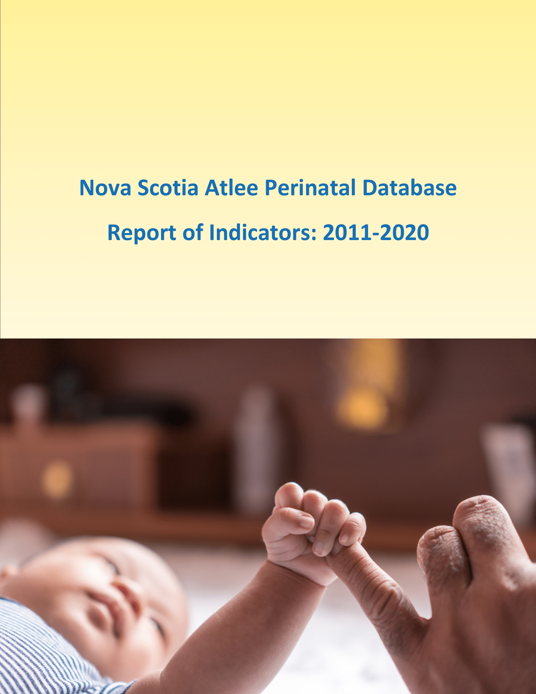

--- 
title: 'Nova Scotia Atlee Perinatal Database'
subtitel: 'Report of Indicators: 2011-2020'
author: 'Estevam Teixeira'
date: '2022-05-13'
site: bookdown::bookdown_site
output: bookdown::bs4_book
documentclass: krantz
monofont: "Source Code Pro"
monofontoptions: "Scale=0.7"
biblio-style: apalike
link-citations: yes
colorlinks: yes
graphics: yes
description: "The data presented in this report are meant to provide a quick reference to the sentinel indicators of perinatal health and care among Nova Scotia residents. We hope this report will assist with the development and monitoring of standards of care and will trigger research questions that can be pursued by researchers and trainees."
github-repo: "https://github.com/estevamteixeira/NSAtleePD"
cover-image: "images/Cover-1.png"
url: http://rcp.nshealth.ca/
---

# Welcome {-}
This is the online home of the *Nova Scotia Atlee Perinatal Database*, a report meant to provide a quick reference to the sentinel indicators of perinatal health and care among Nova Scotia residents.

  
**Note**: Previous editions of this report can be found on the [RCP](http://rcp.nshealth.ca/publications/nsapd-report-indicators-2010-2019) web site.

Inspired by the Free and Open Source Software movement ([FOSS](https://en.unesco.org/freeandopensourcesoftware)), the code and prose underlying this report are open, ensuring that the content is reproducible, transparent, and accessible
Hosting the source code on [GitHub](https://github.com/estevamteixeira/NSAtleePD/) allows anyone to interact with the project by opening issues or contributing new content and typo fixes for the benefit of everyone.

The online version of the report is hosted at [rcp.nshealth.ca/publications]http://rcp.nshealth.ca/publications/nsapd-report-indicators-2010-2019).

This version of the book was built on 2022-05-13.
