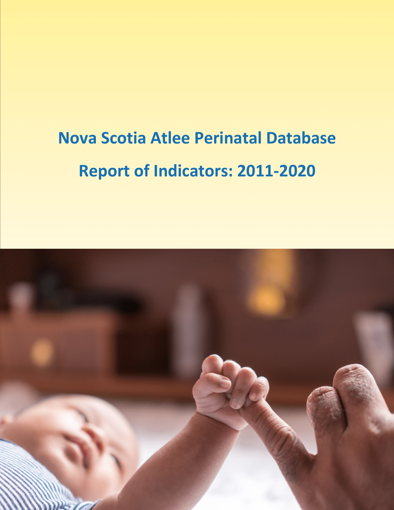

--- 
title: 'Nova Scotia Atlee Perinatal Database'
subtitle: 'Report of Indicators: 2010-2019'
author: 'Estevam Teixeira'
date: '`r Sys.Date()`'
site: bookdown::bookdown_site
output: bookdown::bs4_book
documentclass: krantz
monofont: "Source Code Pro"
monofontoptions: "Scale=0.7"
biblio-style: apalike
link-citations: yes
colorlinks: yes
graphics: yes
description: "The data presented in this report are meant to provide a quick reference to the sentinel indicators of perinatal health and care among Nova Scotia residents. We hope this report will assist with the development and monitoring of standards of care and will trigger research questions that can be pursued by researchers and trainees."
github-repo: "https://github.com/estevamteixeira/NSAtleePD"
cover-image: "images/Cover-1.png"
url: http://rcp.nshealth.ca/
---

```{r index-1, echo=FALSE}
is_on_ghactions = identical(Sys.getenv("GITHUB_ACTIONS"), "true")
is_online = curl::has_internet()
is_html = knitr::is_html_output()
```

```{asis index-2, echo=is_html}
# Welcome {-}
This is the online home of the *Nova Scotia Atlee Perinatal Database*, a report meant to provide a quick reference to the sentinel indicators of perinatal health and care among Nova Scotia residents.
<a href="http://rcp.nshealth.ca/publications/nsapd-report-indicators-2010-2019"></a>
  
**Note**: Previous editions of this report can be found on the [RCP](http://rcp.nshealth.ca/publications/nsapd-report-indicators-2010-2019) web site.

Inspired by the Free and Open Source Software movement ([FOSS](https://en.unesco.org/freeandopensourcesoftware)), the code and prose underlying this report are open, ensuring that the content is reproducible, transparent, and accessible.

Hosting the source code on [GitHub](https://github.com/estevamteixeira/NSAtleePD/) allows anyone to interact with the project by opening issues or contributing new content and typo fixes for the benefit of everyone.

[](https://github.com/estevamteixeira/NSAtleePD)
[](https://github.com/estevamteixeira/NSAtleePD/graphs/contributors)

The online version of the report is hosted at [rcp.nshealth.ca/publications](http://rcp.nshealth.ca/publications/nsapd-report-indicators-2010-2019).
```

```{r index-2.2, echo=FALSE, eval=is_html, results="asis"}
if (is_on_ghactions){
    cat(paste0("This version of the book was built on GH Actions on ", Sys.Date(), "."))
} else {
    cat(paste0("This version of the book was built on ", Sys.Date(), "."))
}
```

```{asis index 2.3, echo=is_html}
## Supporting the project {-}

If you find the report useful, please support it by:

- Telling people about it in person.
- [Citing](https://github.com/Robinlovelace/geocompr/raw/main/CITATION.bib) or [linking-to](https://geocompr.robinlovelace.net/) it
- '[Starring](https://help.github.com/articles/about-stars/)' the [NSAtleePD GitHub repository](https://github.com/estevamteixeira/NSAtleePD)
- Asking questions about or making suggestion on the content via [peru@dal.ca](peru@dal.ca).
```

# Dedication {-}

We would like to honour two neonatologists whom we have lost since our last edition of the Nova Scotia Perinatal Database Report: Drs. Dora A. Stinson and Alexander C. Allen. Both of these physicians worked steadily and tirelessly to improve the health of babies in the province through the clinical care they administered, first at the Grace Maternity Hospital and later at the IWK Health Centre; research; and teaching, mentoring and supporting medical trainees, researchers, and junior faculty members. We will miss them, but will feel their impact forever as we remember their dedication and humour, and do our utmost to build on what they worked so hard to accomplish for the health and well being of Nova Scotians.

**Dr. Dora Stinson, MD, FRCPC, FAAP (1939-2020)** was actively involved in every aspect of neonatal medicine for many years, in research, administration and directly in clinical treatment of children. Dr. Stinson was well known locally and nationally as a skilled physician, a dedicated teacher and mentor, and a valued colleague. She acted as the Neonatal Clinical Advisor for the Reproductive Care Program for several years, and provided thoughtful input on several of the indicators shown herein.

```{r dora, echo=FALSE, message=FALSE, warning=FALSE, fig.align='center', out.width='20%', fig.cap='Dr. Dora Stinson.'}
knitr::include_graphics("images/Dora.png")
```

**Dr. Alec Allen, MDCM, FAAP, FRCPC (1933-2018)** had extraordinary vision when he established the Nova Scotia Atlee Perinatal Database in the 1980s, well before other similar databases were established in other provinces. His hard work made this Report, over one hundred research projects, and many quality improvement initiatives possible. Among his many accomplishments, Dr. Allen established the Perinatal Epidemiology Research Unit and served as its first director until 2010.

```{r alec, echo=FALSE, fig.align='center', out.width='20%', fig.cap='Dr. Alec Allen.'}

```

# Acknowledgements {-}

This Nova Scotia Atlee Perinatal Database Report was developed and prepared by members of the Perinatal Epidemiology Research Unit (PERU) in collaboration with the Reproductive Care Program (RCP) of Nova Scotia. All members of RCP provided valuable input, but we would like to especially acknowledge John Fahey (Research Analyst), Becky Attenborough (Manager), Leeanne Lauzon (Perinatal Nurse Consultant), and Irene Gagnon (Clinical Data Coordinator). We would also like to thank Alexa MacDonald, who helped to compile and edit the current report. Of course, all of the health information professionals, health care providers, and administrators at participating hospitals are invaluable to maintaining the high quality data found within the Atlee Perinatal Database.

**Members of the Perinatal Epidemiology Research Unit Departments of Obstetrics & Gynaecology and Pediatrics**

- Azar Mehrabadi, PhD, Assistant Professor
- Stefan Kuhle, MD, PhD, Associate Professor
- Christy Woolcott, PhD, Director, Associate Professor
- Linda Dodds, PhD, Past Director, Professor

```{r 3-logos, echo=FALSE, fig.align='center', out.width='90%'}

```

# Introduction {-}

## Purpose of Report {-}

The data presented in this Report are meant to provide a quick reference to the sentinel indicators of perinatal health and care among Nova Scotia residents. In addition, we hope that the data in this Report will assist with
the development and monitoring of standards of care and will trigger research questions that can be pursued by researchers and trainees.

## Nova Scotia Atlee Perinatal Database {-}

The Nova Scotia Atlee Perinatal Database (NSAPD) is a population-based database that contains detailed province-wide clinical and demographic information from 1988 onwards. Data are abstracted on-site in Nova
Scotia health care facilities by health information professionals and are contributed to the NSAPD by these facilities. The Reproductive Care Program (RCP), a program of the IWK Health Centre, is the NSAPD custodian.

The population in the NSAPD includes all reported liveborn and stillborn infants at a gestational age of at least 20 weeks or having a birth weight of at least 500 g. Every effort is made to ensure that the NSAPD includes
perinatal events for all Nova Scotia residents. Events that occurred in Nova Scotia facilities that do not have active maternity services are collected, as are events that occur in New Brunswick facilities where Nova Scotia
residents regularly seek care. Home births have been included in the NSAPD since the introduction of regulated midwifery in 2009.

## Important Notes Regarding Definitions and Figures {-}

A Glossary of all terms can be found at the end of this report.

The term "birth" is differentiated from "delivery". A delivery refers to the completed pregnancy, regardless of the number of infants born. Birth refers to the live born or stillborn infant. For example, when a woman delivers
twins, one delivery and two births are represented.

The definition of gestational age, which is detailed in the Glossary, incorporates information on ultrasound measurements, as well as last menstrual period date and clinical estimate of gestational age.

It is important to note the scale that is used in the Figures. In some instances, the rate of a particular indicator will appear to vary greatly from year to year, but the apparent variation may be due to a narrow range for the
scale.

## Future Reports {-}

We plan to produce similar reports on a regular basis. Updated reports will be posted on the RCP web site [http://rcp.nshealth.ca](http://rcp.nshealth.ca). As always, we welcome comments and suggestions for additional indicators to be
included in these future reports (peru@dal.ca).